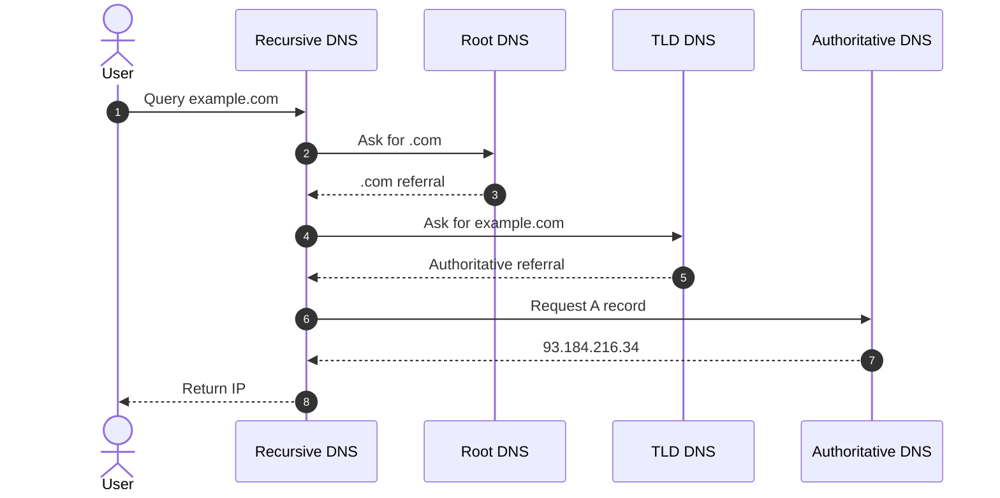

# DNS Resolution Flow

```mermaid
sequenceDiagram
    autonumber
    actor User
    participant Recursive as Recursive DNS
    participant Root as Root DNS
    participant TLD as TLD DNS
    participant Auth as Authoritative DNS

    User->>Recursive: Query example.com
    Recursive->>Root: Ask for .com
    Root-->>Recursive: .com referral
    Recursive->>TLD: Ask for example.com
    TLD-->>Recursive: Authoritative referral
    Recursive->>Auth: Request A record
    Auth-->>Recursive: 93.184.216.34
    Recursive-->>User: Return IP
```
